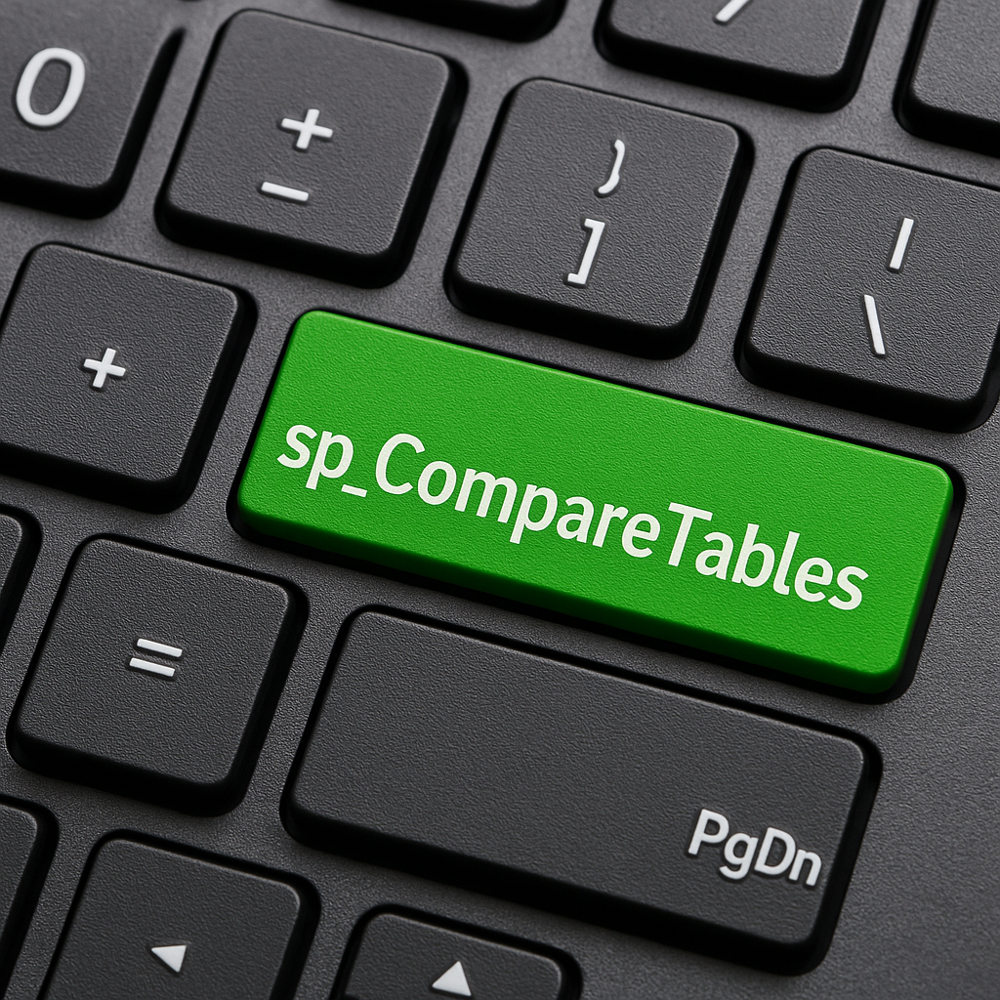
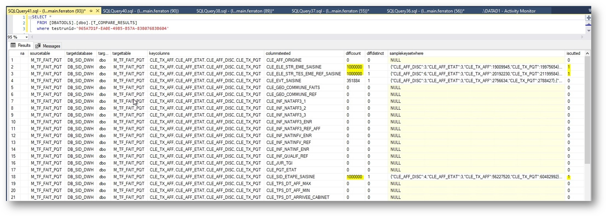
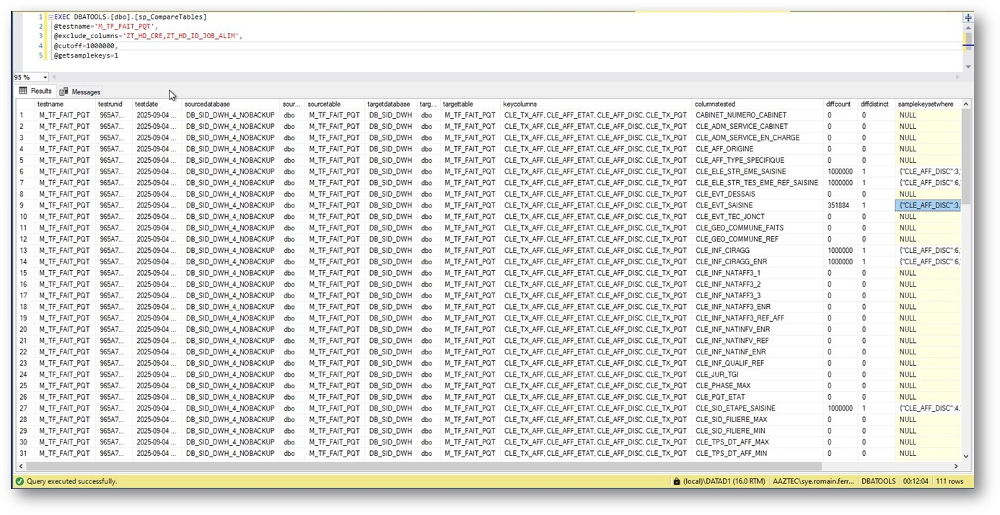
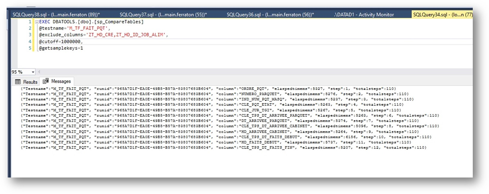

# sp\_CompareTables




## Overview

`sp_CompareTables` is a stored procedure for SQL Server that compares two tables (or views) defined in the configuration table `T_COMPARE_CONFIG`.
It uses `EXCEPT` queries to efficiently detect row and column differences.

The procedure performs a staged comparison:

1. **Row Count Check** – If the source and target row counts differ, comparison stops.
2. **Key Consistency Check** – If the sets of key values differ, comparison stops.
3. **Column-by-Column Comparison** – For each non-key column (optionally filtered with `@include_columns` / `@exclude_columns`), the procedure runs an `EXCEPT` between source and target on `(keys + column)` and counts the differences.

Results are stored in `T_COMPARE_RESULTS` and also returned to the caller.

---

## Signature

```sql
CREATE OR ALTER PROCEDURE [dbo].[sp_CompareTables]
(
    @testname         NVARCHAR(255),
    @include_columns  NVARCHAR(MAX) = NULL,     -- CSV : columns explicitly tested
    @exclude_columns  NVARCHAR(MAX) = NULL,     -- CSV : columns to exclude
    @cutoff           BIGINT        = 1000000,  -- cutoff for EXCEPT temp results (0 = no cutoff, use full compare)
    @getsamplekeys    BIT           = 0,        -- if 1, return sample keyset WHERE clause for one differing row
    @debug            BIT           = 0         -- if 1, prints all dynamic SQL generated
)
```

---

## Configuration Table

The tables or views to compare are defined in `T_COMPARE_CONFIG`:

```sql
CREATE TABLE dbo.T_COMPARE_CONFIG
(
    testname       NVARCHAR(255) PRIMARY KEY,
    sourcedatabase SYSNAME,
    sourceschema   SYSNAME,
    sourcetable    SYSNAME,
    targetdatabase SYSNAME,
    targetschema   SYSNAME,
    targettable    SYSNAME,
    keycolumns     NVARCHAR(1000)  -- CSV list of key columns
);
```

* `testname` – unique identifier for the comparison test.
* `sourcedatabase/sourceschema/sourcetable` – fully qualifies the source.
* `targetdatabase/targetschema/targettable` – fully qualifies the target.
* `keycolumns` – comma-separated list of key columns (must uniquely identify a row).

---

## Results Table

Comparison results are stored in `T_COMPARE_RESULTS`:

```sql
CREATE TABLE dbo.T_COMPARE_RESULTS
(
    testname          NVARCHAR(255),
    testrunid         UNIQUEIDENTIFIER,
    testdate          DATETIME2(3),
    sourcedatabase    SYSNAME,
    sourceschema      SYSNAME,
    sourcetable       SYSNAME,
    targetdatabase    SYSNAME,
    targetschema      SYSNAME,
    targettable       SYSNAME,
    keycolumns        NVARCHAR(1000),
    columnstested     SYSNAME,          -- 'count(*)' or column name
    diffcount         BIGINT,           -- number of differing rows
    diffdistinct      BIGINT NULL,      -- number of distinct differing values
    samplekeysetwhere VARCHAR(4000)     -- WHERE clause for one example diff row (if @getsamplekeys=1)
);
```

---

## Workflow of the procedure

1. **Count(\*) Check**

   * Compares total row counts of source and target.
   * If different, result is stored with `columnstested = 'count(*)'` and procedure exits.

2. **Key Set Check**

   * Compares sets of key values using `EXCEPT`.
   * If different, procedure exits.

3. **Column Comparison**

   * Iterates over non-key columns one by one.
   * If `@include_columns` is provided, only those are tested.
   * If `@exclude_columns` is provided, those are ignored.
   * Each tested column is compared with an `EXCEPT` on `(keys + column)`.
   * Results inserted into `T_COMPARE_RESULTS` with:

     * `diffcount` = number of differing rows
     * `diffdistinct` = number of distinct differing values
     * `samplekeysetwhere` = up to 10 sample keysets with differing values for the tested column (if `@getsamplekeys=1`)

---

## Parameters

* `@testname` – Name of the test (must exist in `T_COMPARE_CONFIG`).
* `@include_columns` – CSV of columns to test explicitly.
* `@exclude_columns` – CSV of columns to exclude.
* `@cutoff` – Max number of rows processed from EXCEPT (for performance).

  * Default: `1,000,000`.
  * Use `0` for full comparison (may be slower).
* `@getsamplekeys` – If `1`, generate `samplekeysetwhere` up to 10 rows with differing keyset.
* `@debug` – If `1`, prints all generated dynamic SQL for inspection.

---

## Sample Test Setup

```sql
INSERT INTO [dbo].[T_COMPARE_CONFIG] 
([testname],
 [sourcedatabase],[sourceschema],[sourcetable],
 [targetdatabase],[targetschema],[targettable],
 [keycolumns])
VALUES
('tpch10_orders',
 'tpch_copy','tpch_10','orders',
 'tpch_test','dbo','orders_15M',
 'o_orderkey');
```

---

## Sample Usage

```sql
EXEC [dbo].[sp_CompareTables] 
     @testname        = 'tpch10_orders',        -- test name from T_COMPARE_CONFIG (where to find source/target)
   --@include_columns = 'o_orderkey,o_custkey', -- include columns from comparison if needed
     @exclude_columns = 'o_comment,o_clerk',    -- exclude columns from comparison if needed
     @cutoff          = 1000000,                -- max rows to process output from EXCEPT (Nota compare are done on all rows, @cutoff is just for performance and limiting the output in the temp table), setting to 0 will use full dump of EXCEPT
     @getsamplekeys   = 1,                      -- retrieve up to 10 sample keysets for differing rows
     @debug           = 0;                      -- set to 1 to see generated SQL
```

## Some screenshots

### T\_COMPARE\_RESULTS after running the procedure :


### Example output of the procedure in SSMS :


### Messages during the run :


