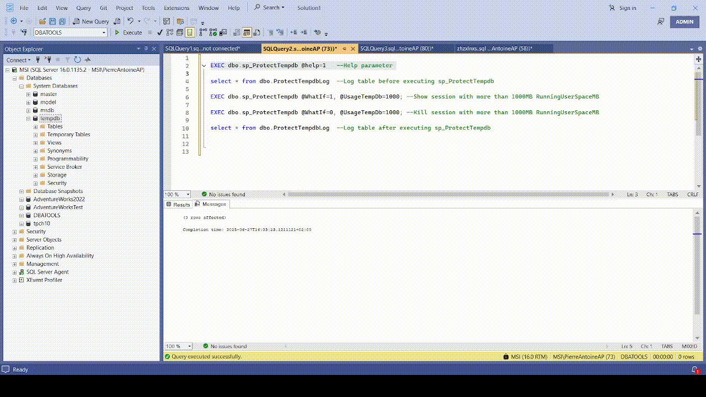

# sp_ProtectTempdb

`sp_ProtectTempdb` is a free tool developed and maintained by [Architecture & Performance](https://www.architecture-performance.fr/) for SQL Server Database Administrators who need to quickly identify and terminate sessions excessively consuming `tempdb` space. It is particularly useful in scenarios where `tempdb` pressure is impacting performance, stability, or causing out-of-space conditions.



---

## Why would you use sp_ProtectTempdb?

In the same spirit as community-driven tools like [sp_WhoIsActive](https://github.com/amachanic/sp_whoisactive), `sp_ProtectTempdb` was built to address a common pain point: quickly identifying and managing the sessions causing the most `tempdb` usage. This is especially valuable in emergency situations or automated health-check scripts.

---

## What does sp_ProtectTempdb do?

`sp_ProtectTempdb` analyzes session-level usage of `tempdb` and can optionally terminate the offending sessions that exceed a user-defined usage threshold. It includes flexible filters and safeguards to ensure the procedure behaves safely and predictably.

This tool supports the following capabilities:

* **Filters**: Include or exclude sessions by login name or program name (SQL Server 2016+).
* **Threshold logic**: Use a percentage or fixed size in MB to define what "excessive" usage means.
* **Preview mode**: Use `@WhatIf = 1` to review which sessions would be terminated *without* killing them.
* **Exception handling**: Use `@ThrowException = 1` to raise a SQL exception if any session fails to be killed (useful for alerting).
* **Self-documenting**: Use `@Help = 1` to view in-script documentation and parameter descriptions.
* **Logging**: Automatically logs all killed sessions to a dedicated audit table (`dbo.ProtectTempdbLog`).

---

## How do I use it?

First, install the stored procedure in your preferred system database (e.g., `master`) to make it accessible from any database context.

### Basic Usage

```sql
EXEC sp_ProtectTempdb;
````

This will scan for sessions using more than 50% of `tempdb` (default) and terminate them if found.

### Preview Sessions Before Killing

```sql
EXEC sp_ProtectTempdb @WhatIf = 1;
```

This will show which sessions *would be* killed, but won’t actually run the `KILL` commands.

---

## Parameters

| Parameter                              | Description                                                                                                                                                                                                                             |
| -------------------------------------- | --------------------------------------------------------------------------------------------------------------------------------------------------------------------------------------------------------------------------------------- |
| **@UsageTempDb** `DECIMAL(18,2)`       | Threshold for session tempdb usage. Values between 0 and 1 are treated as a percentage (e.g., `0.5` = 50%). Values ≥ 1 are interpreted as fixed size in MB. Required to be ≥ 1 if any tempdb file has unlimited growth. Default: `0.5`. |
| **@IncludeLogin** `VARCHAR(MAX)`       | Comma-separated list of logins to include (SQL Server 2016+ only).                                                                                                                                                                      |
| **@ExcludeLogin** `VARCHAR(MAX)`       | Comma-separated list of logins to exclude (SQL Server 2016+ only).                                                                                                                                                                      |
| **@IncludeProgramName** `VARCHAR(MAX)` | Comma-separated list of program names to include (SQL Server 2016+ only).                                                                                                                                                               |
| **@ExcludeProgramName** `VARCHAR(MAX)` | Comma-separated list of program names to exclude (SQL Server 2016+ only).                                                                                                                                                               |
| **@WhatIf** `BIT`                      | If set to 1, only displays the sessions that would be killed. No actions taken. Default: `0`.                                                                                                                                           |
| **@ThrowException** `BIT`              | If set to 1, the procedure will raise an exception (`THROW 50001`) if a session fails to be killed. Useful for monitoring/alerting. Default: `0`.                                                                                       |
| **@Help** `BIT`                        | Displays inline help information and exits. Default: `0`.                                                                                                                                                                               |

---

## Logging and Audit Table

All terminated sessions are logged in the table `dbo.ProtectTempdbLog`. This ensures a permanent, queryable audit trail of actions taken by `sp_ProtectTempdb`.

### Table Definition

```sql
CREATE TABLE dbo.ProtectTempdbLog (
    SessionId INT,
    LoginName NVARCHAR(256),
    ProgramName NVARCHAR(1000),
    RunningUserSpaceMB NUMERIC(10,1),
    ThresholdMB NUMERIC(10,1),
    StatementText NVARCHAR(MAX),
    ExecutionDateTime DATETIME DEFAULT GETDATE()
);
```

### Log Description

| Column               | Description                                           |
| -------------------- | ----------------------------------------------------- |
| `SessionId`          | ID of the session that was terminated.                |
| `LoginName`          | Login associated with the session.                    |
| `ProgramName`        | Application name (e.g., SSMS, custom app).            |
| `RunningUserSpaceMB` | Amount of `tempdb` space (in MB) used by the session. |
| `ThresholdMB`        | Threshold (in MB) that triggered the termination.     |
| `StatementText`      | SQL statement executed (e.g., `KILL 59`).             |
| `ExecutionDateTime`  | Timestamp of when the session was killed.             |

You can query this log for historical analysis, automation feedback, or compliance auditing.

---

## What are the requirements?

### 1. **SQL Server 2012 or higher**

* This procedure only supports SQL Server 2012 and above.
* Filtering by login or program name requires SQL Server 2016+.

### 2. **Permissions**

* You must have **`KILL` permissions**, typically `sysadmin`, to terminate sessions.
* You must also have `VIEW SERVER STATE` permission to read DMVs.

---

## Limitations

* Will abort execution if:

  * `@UsageTempDb` is below 1 and tempdb has any unlimited growth files.
  * SQL Server version is below 2012.
  * Filtering options are used on unsupported versions (pre-2016).
* Only sessions with non-zero tempdb usage are considered.
* If `@ThrowException = 1` and a session fails to be terminated, an exception will be raised and execution will stop.
* Long-running sessions with high tempdb usage should be carefully evaluated before termination.

---

## Output

### When `@WhatIf = 1`:

* A summary of `tempdb` usage.
* A list of sessions exceeding the threshold, including login name, program, session ID, memory usage, and SQL text.

### When executing normally:

* Same session list as above.
* Followed by actual `KILL` commands executed for each matching session.
* If `@ThrowException = 1`, the procedure will raise an error on any failed `KILL`, otherwise it will `PRINT` the error message.
* All terminated sessions will be logged into `dbo.ProtectTempdbLog`.

---

## Example

```sql
-- Simulate execution to identify high tempdb usage:
EXEC sp_ProtectTempdb @UsageTempDb = 0.7, @WhatIf = 1;

-- Terminate all sessions using more than 100MB:
EXEC sp_ProtectTempdb @UsageTempDb = 100;

-- Only kill sessions from specific programs:
EXEC sp_ProtectTempdb @IncludeProgramName = 'MyApp1,MyApp2';

-- Raise error if any session fails to be killed:
EXEC sp_ProtectTempdb @UsageTempDb = 150, @ThrowException = 1;
```

---

## Version

* **Version**: 1.0
* **Date**: 2025-06-25
* Maintained by: **[Pierre-Antoine Collet](https://www.linkedin.com/in/pierre-antoine-collet-6a3747222/) from [Architecture & Performance](https://www.architecture-performance.fr/)**


